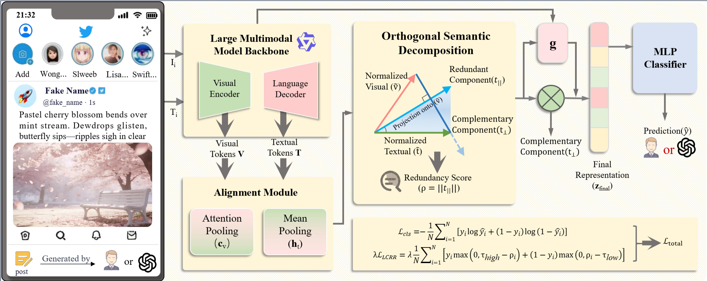

# UMPIRE: Unveiling LLM-generated Patterns In Redundant Expressions

[](https://arxiv.org/abs/your-paper-link)
[]()
[](https://opensource.org/licenses/MIT)
[]()
[]()

## 📖 Abstract

The proliferation of Large Language Models (LLMs) has saturated social media platforms with hyper-realistic posts, rendering traditional detection methods that rely on low-level artifacts or unimodal statistics increasingly ineffective. In this work, we identify a fundamental semantic distinction: humans tend to complement visual content with additional context, while LLMs predominantly describe the visual information. To capture this, \Name employs an orthogonal semantic decomposition mechanism that disentangles textual embeddings into redundant and complementary components. An adaptive gating module dynamically weighs these components to reflect diverse communicative styles. To enforce the desired geometric structure, we introduce a latent contrastive redundancy regularization loss that encourages LLM-generated content to exhibit high semantic redundancy, while human-written content emphasizes complementarity. Experimental results demonstrate that \Name significantly outperforms state-of-the-art detection methods across multiple datasets, achieving up to a 5.38\% improvement in accuracy.

**UMPIRE** is a behavior-centric detection framework that:

1. **Disentangles** textual embeddings into *Redundant* (visually grounded) and *Complementary* (external context) components via Orthogonal Semantic Decomposition.
2. **Dynamically weighs** these components using an Adaptive Gating mechanism.
3. **Enforces** geometric structure through a novel Latent Contrastive Redundancy Regularization (LCRR) loss.


*(Note: Place the framework image from the paper in an `assets` folder)*

## 🚀 Key Features

* **Orthogonal Semantic Decomposition**: Mathematically separates visual description from external context.
* **Adaptive Gating**: Handles diverse human writing styles (from storytelling to news reporting).
* **Behavior-Aware Loss**: $\mathcal{L}_{LCRR}$ penalizes LLMs for low redundancy and humans for high redundancy.
* **Plug-and-Play**: Compatible with various multimodal backbones (Qwen-VL, CLIP, LLaVA).

## 📂 Project Structure

```text
UMPIRE/
├── assets/               # Images and diagrams
├── umpire/
│   ├── __init__.py
│   ├── model.py          # Core UMPIRE Architecture
│   ├── modules.py        # Attention Pooling & Gating layers
│   ├── loss.py           # Custom L_LCRR Loss Function
│   └── utils.py          # Helper functions
├── main.py               # Example training loop
├── requirements.txt      # Dependencies
└── README.md
```

## 🛠️ Installation

1. **Clone the repository:**

```bash
    git clone https://github.com/yourusername/UMPIRE.git
    cd UMPIRE
    ```

2.  **Create a virtual environment (optional but recommended):**
    ```bash
    conda create -n umpire python=3.9
    conda activate umpire
    ```

3.  **Install dependencies:**
    ```bash
    pip install -r requirements.txt
    ```

## ⚡ Quick Start

Here is a minimal example of how to initialize the model and perform a forward pass with dummy data.

```python
import torch
from umpire.model import UMPIRE
from umpire.loss import UMPIRELoss

# 1. Configuration
device = "cuda" if torch.cuda.is_available() else "cpu"
FEATURE_DIM = 1024 # Dimension from your backbone (e.g., Qwen2-VL)

# 2. Initialize Model
model = UMPIRE(feature_dim=FEATURE_DIM, projection_dim=512).to(device)
criterion = UMPIRELoss(lambda_reg=0.5, tau_high=0.8, tau_low=0.2)

# 3. Dummy Data (Batch Size=8)
# In practice, these come from your frozen Multimodal Backbone
visual_feats = torch.randn(8, 196, FEATURE_DIM).to(device) # [B, L_v, D]
text_feats = torch.randn(8, 50, FEATURE_DIM).to(device) # [B, L_t, D]
labels = torch.randint(0, 2, (8, 1)).float().to(device) # 0=Human, 1=LLM

# 4. Forward Pass
predictions, rho = model(visual_feats, text_feats)

# 5. Compute Loss
loss, l_cls, l_lcrr = criterion(predictions, labels, rho)

print(f"Total Loss: {loss.item():.4f}")
print(f"Redundancy Scores (rho): {rho.flatten().detach().cpu().numpy()}")
```

## 🧠 Core Methodology Implementation

### Orthogonal Decomposition

The heart of UMPIRE lies in `umpire/model.py`. We project the normalized text embedding $\tilde{t}$ onto the visual centroid $\tilde{v}$:

```python
# From umpire/model.py
def orthogonal_decomposition(self, v_embed, t_embed):
 # Redundant Component (Parallel to visual)
 dot_prod = torch.bmm(t_embed.unsqueeze(1), v_embed.unsqueeze(2)).squeeze(2)
 t_para = dot_prod * v_embed

 # Complementary Component (Orthogonal to visual)
 t_perp = t_embed - t_para

 # Redundancy Score
 rho = torch.norm(t_para, p=2, dim=-1, keepdim=True)
 return t_para, t_perp, rho
```

### Regularization Loss

Our custom loss ensures the geometric separation between Human and LLM content:

```python
# From umpire/loss.py
# For LLMs (y=1): Encourage high redundancy (rho > tau_high)
loss_llm = labels * torch.relu(self.tau_high - redundancy_scores)

# For Humans (y=0): Encourage low redundancy (rho < tau_low)
loss_human = (1 - labels) * torch.relu(redundancy_scores - self.tau_low)
```

## 📊 Experiments

To reproduce the results on **TwiBot-22**, **Fakeddit**, and **Hateful Memes**, please follow these steps:

1. **Data Preparation**:
   * Download datasets (Links provided in `data/README.md`).
   * Run preprocessing script: `python data/preprocess.py`.
2. **Training**:
   ```bash
   python train.py --dataset twibot22 --backbone qwen2-vl --epochs 10
   ```
3. **Evaluation**:
   ```bash
   python eval.py --checkpoint checkpoints/best_model.pth
   ```

## 📊 Datasets

We evaluate UMPIRE on three diverse multimodal benchmarks representing different social media contexts (social bot detection, fake news, and hate speech). The dataset statistics and processing details are as follows:

| Dataset                 | Type        | Domain      | Total Samples     | Human (Negative)         | LLM/Bot (Positive)  | Description                                                                   |
| :---------------------- | :---------- | :---------- | :---------------- | :----------------------- | :------------------ | :---------------------------------------------------------------------------- |
| **TwiBot-22**     | Social Bot  | Twitter (X) | ~30,000           | Human Users              | Synthetic Bots      | Used the verified human subset vs. synthetic bot-labeled posts.               |
| **Fakeddit**      | Fake News   | Reddit      | ~30,000           | Context-rich discussions | Machine-manipulated | Focuses on multimodal misinformation and fine-grained fake news detection.    |
| **Hateful Memes** | Hate Speech | Facebook    | ~30,000           | Benign abstraction       | Synthetic Hate      | High-abstraction memes where text and image often have complex relationships. |
| **NewsCLIPpings** | Fake News   | News        | Used for Training | Journalism               | Machine-manipulated | Used primarily for constructing the training set to learn general patterns.   |

> **Note on LLM Generation:**
> To construct the positive class (LLM-generated), we utilized state-of-the-art models including **GPT-4o**, **Qwen2-VL**, and **Claude 3.5 Sonnet**.
>
> * **Split Ratio:** 70% Training / 15% Validation / 15% Testing (Stratified).
> * **Image Resolution:** Resized to standard $224 \times 224$.

---

## ⚙️ Hyperparameters

We provide the default hyperparameter settings used to achieve the results reported in the paper. These settings are optimized for the **Qwen2-VL** backbone.

### Model Architecture

| Parameter               |      Symbol      | Value | Description                                       |
| :---------------------- | :--------------: | :---: | :------------------------------------------------ |
| Visual Token Seq Length |     $L_v$     |  196  | Corresponds to$14 \times 14$ patches.           |
| Text Token Seq Length   |     $L_t$     |  50  | Max length for caption/text tokens.               |
| Backbone Feature Dim    | $d_{backbone}$ | 1024 | Output dimension of Qwen2-VL / CLIP.              |
| Projection Dim          |      $d$      |  512  | Dimension of the detection-specific metric space. |
| Classifier Hidden Dim   |        -        |  256  | Hidden layer size in the final MLP.               |

### Training Configuration

| Parameter               |   Symbol   |    Value    | Description                                    |
| :---------------------- | :--------: | :---------: | :--------------------------------------------- |
| **Batch Size**    |   $B$   |     32     | Adjusted based on GPU memory (tested on A100). |
| **Learning Rate** | $\alpha$ | $1e^{-5}$ | Using Adam optimizer.                          |
| **Epochs**        |     -     |     10     | With early stopping based on validation loss.  |
| **Weight Decay**  |     -     | $1e^{-4}$ | L2 regularization for optimizer.               |

### Loss Function ($\mathcal{L}_{total} = \mathcal{L}_{cls} + \lambda \mathcal{L}_{LCRR}$)

This is the most critical configuration for reproducing our geometric regularization results.

| Parameter                        |     Symbol     |     Value     | Description                                                     |
| :------------------------------- | :-------------: | :-----------: | :-------------------------------------------------------------- |
| **Regularization Weight**  |   $\lambda$   | **0.5** | Controls the strength of the geometric loss vs. classification. |
| **High Redundancy Margin** | $\tau_{high}$ | **0.8** | Threshold for LLM samples (pushes$\rho$ above 0.8).           |
| **Low Redundancy Margin**  | $\tau_{low}$ | **0.2** | Threshold for Human samples (pushes$\rho$ below 0.2).         |

---

### 💡 Reproducibility Tips

* **Backbone Freeze:** We freeze the weights of the multimodal backbone (e.g., Qwen2-VL) and only train the UMPIRE modules (Alignment, Gating, Projection Heads). This significantly reduces computational cost.
* **Initialization:** We use Xavier initialization for the adaptive gate parameters ($W_g, b_g$) and Projection Heads.
* **Metric:** We use **AUROC** as the primary metric for model selection during validation, as it is robust to class imbalance.

## 📄 License

This project is licensed under the MIT License - see the [LICENSE](LICENSE) file for details.
